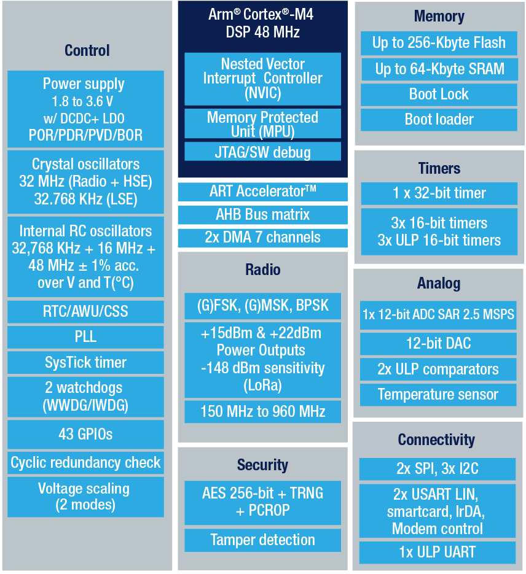

# [STM32WLE5](https://github.com/SoCXin/STM32WLE5)

* [ST](https://www.st.com/zh/)：[Cortex-M4](https://github.com/SoCXin/Cortex)
* [L3R6](https://github.com/SoCXin/Level) ：48 MHz  * 1.25 DMIPS/MHz

## [简介](https://github.com/SoCXin/STM32WLE5/wiki)

[STM32WLE5](https://github.com/SoCXin/STM32WLE5) 系列基于运行于48 MHz的Arm® Cortex®‐M4内核以及Semtech SX126x的sub-GHz无线电，是一种支持LoRa、(G)FSK、(G)MSK和BPSK调制的开放式平台。

### 关键特性

* 150 MHz to 960 MHz ,LoRa®, FSK, MSK ,BPSK
* 209MHz Cortex®-M4

#### 封装规格

* UFQFPN48（7x7mm）
* UFBGA73（5x5mm）

### [资源收录](https://github.com/SoCXin/STM32WLE5)

* [参考文档](docs/)
* [参考资源](src/)
* [参考工程](project/)

### [选型建议](https://github.com/SoCXin)

[STM32WLE5](https://github.com/SoCXin/STM32WLE5)

### [探索芯世界 www.SoC.xin](http://www.SoC.Xin)
